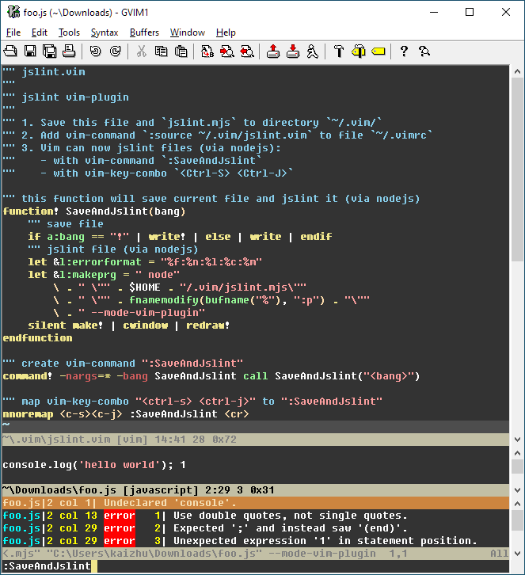

[](https://github.com/jslint-org/jslint)


# JSLint, The JavaScript Code Quality Tool

&nbsp;

Douglas Crockford <douglas@crockford.com>


# Status
| Branch | [master<br>(v2021.9.20)](https://github.com/jslint-org/jslint/tree/master) | [beta<br>(Web Demo)](https://github.com/jslint-org/jslint/tree/beta) | [alpha<br>(Development)](https://github.com/jslint-org/jslint/tree/alpha) |
|--:|:--:|:--:|:--:|
| CI | [](https://github.com/jslint-org/jslint/actions?query=branch%3Amaster) | [](https://github.com/jslint-org/jslint/actions?query=branch%3Abeta) | [](https://github.com/jslint-org/jslint/actions?query=branch%3Aalpha) |
| Coverage | [](https://jslint-org.github.io/jslint/branch-master/.build/coverage/index.html) | [](https://jslint-org.github.io/jslint/branch-beta/.build/coverage/index.html) | [](https://jslint-org.github.io/jslint/branch-alpha/.build/coverage/index.html) |
| Demo | [](https://jslint-org.github.io/jslint/branch-master/index.html) | [](https://jslint-org.github.io/jslint/branch-beta/index.html) | [](https://jslint-org.github.io/jslint/branch-alpha/index.html) |
| Artifacts | [](https://github.com/jslint-org/jslint/tree/gh-pages/branch-master/.build) | [](https://github.com/jslint-org/jslint/tree/gh-pages/branch-beta/.build) | [](https://github.com/jslint-org/jslint/tree/gh-pages/branch-alpha/.build) |


# Table of Contents
1. [Web Demo](#web-demo)
2. [Web Demo Archived](#web-demo-archived)
3. [Install](#install)
4. [Description](#description)
5. [Package Listing](#package-listing)
6. [Changelog](#changelog)
7. [License](#license)


# Web Demo
- https://www.jslint.com

[](https://jslint-org.github.io/jslint/index.html)


# Web Demo Archived
- [Web Demo 2020](https://www.jslint.com/branch-v2020.11.6/index.html)
- [Web Demo 2014 (ES5 only)](https://www.jslint.com/branch-v2014.7.8/jslint.html)
- [Web Demo 2013 (ES5, CSS, HTML)](https://www.jslint.com/branch-v2013.3.13/jslint.html)


# Install
## To install, just download https://www.jslint.com/jslint.mjs and save to file:
```shell <!-- shRunWithScreenshotTxt .build/screenshot-install-download.svg -->
#!/bin/sh

curl -L https://www.jslint.com/jslint.mjs > jslint.mjs
```
- shell output


## To run `jslint.mjs` from command-line:
```shell <!-- shRunWithScreenshotTxt .build/screenshot-install-cli-file.svg -->
#!/bin/sh

printf "console.log('hello world');\n" > hello.js

node jslint.mjs hello.js
```
- shell output


## To import `jslint.mjs` as es-module:
```shell <!-- shRunWithScreenshotTxt .build/screenshot-install-import.svg -->
#!/bin/sh

node --input-type=module -e '

/*jslint devel*/
import jslint from "./jslint.mjs";
let globals = ["caches", "indexedDb"];
let options = {browser: true};
let result;
let source = "console.log(\u0027hello world\u0027);\n";
result = jslint(source, options, globals);
result.warnings.forEach(function ({
    formatted_message
}) {
    console.error(formatted_message);
});

'
```
- shell output


## To jslint entire directory:
```shell <!-- shRunWithScreenshotTxt .build/screenshot-install-cli-dir.svg -->
#!/bin/sh

node jslint.mjs .
```
- shell output


<!-- coverage-hack
```javascript
"use strict";
```
-->

## To run jslint as vim-plugin:
1. Download and save [`jslint.mjs`](https://www.jslint.com/jslint.mjs), [`jslint.vim`](https://www.jslint.com/jslint.vim) to directory `~/.vim/`
2. Add vim-command `:source ~/.vim/jslint.vim` to file `~/.vimrc`
3. Vim can now jslint files (via nodejs):
    - with vim-command `:SaveAndJslint`
    - with vim-key-combo `<Ctrl-S> <Ctrl-J>`
- screenshot




# Description
- [jslint.mjs](jslint.mjs) contains the jslint function. It parses and analyzes a source file, returning an object with information about the file. It can also take an object that sets options.

- [index.html](index.html) runs the jslint.mjs function in a web page. The page also depends on `browser.mjs`.

- [browser.mjs](browser.mjs) runs the web user interface and generates the results reports in HTML.

- [help.html](help.html) describes JSLint's usage. Please [read it](https://jslint-org.github.io/jslint/help.html).

- [function.html](function.html) describes the jslint function and the results it produces.

JSLint can be run anywhere that JavaScript (or Java) can run.

The place to express yourself in programming is in the quality of your ideas and
the efficiency of their execution. The role of style in programming is the same
as in literature: It makes for better reading. A great writer doesn't express
herself by putting the spaces before her commas instead of after, or by putting
extra spaces inside her parentheses. A great writer will slavishly conform to
some rules of style, and that in no way constrains her power to express herself
creatively. See for example William Strunk's The Elements of Style
[https://www.crockford.com/style.html].

This applies to programming as well. Conforming to a consistent style improves
readability, and frees you to express yourself in ways that matter. JSLint here
plays the part of a stern but benevolent editor, helping you to get the style
right so that you can focus your creative energy where it is most needed.


# Package Listing


# Changelog
- [Full CHANGELOG.md](CHANGELOG.md)


# License
- JSLint is under [Unlicense License](LICENSE).
- CodeMirror code-editor is under [MIT License](https://github.com/codemirror/CodeMirror/blob/master/LICENSE).
